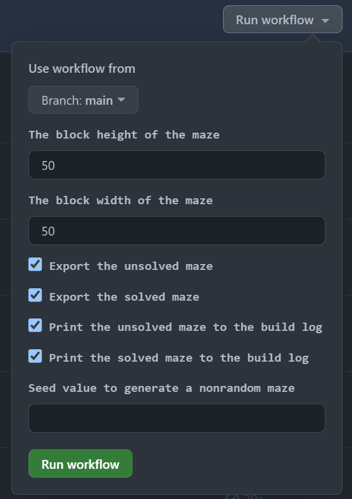

# Maze 🟩🟦🟥

This project generates a rectangular maze and its solution. The generation uses iterative implementations of Prim's algorithm, while solving the maze using an iterative implementation of depth-firs-search algorithm. There are two ways you can run this project: on your local machine or by using the configure Github Action in this repository. Both methods are documented in this readme.

Here is an example of a maze and its solution.

- 🟩 is the starting point
- 🟦 are possible paths
- 🟥 is the finishing point
- ⬛ are walls

⬛🟩⬛⬛⬛⬛⬛⬛⬛⬛⬛⬛⬛⬛⬛⬛⬛⬛⬛⬛⬛⬛⬛⬛⬛⬛⬛<br>
⬛🟦🟦🟦🟦🟦🟦🟦🟦🟦⬛🟦🟦🟦🟦🟦🟦🟦🟦🟦🟦🟦🟦🟦⬛🟦⬛<br>
⬛🟦⬛⬛⬛⬛⬛🟦⬛⬛⬛🟦⬛🟦⬛🟦⬛⬛⬛⬛⬛⬛⬛⬛⬛🟦⬛<br>
⬛🟦🟦🟦🟦🟦⬛🟦🟦🟦🟦🟦⬛🟦⬛🟦🟦🟦🟦🟦🟦🟦⬛🟦⬛🟦⬛<br>
⬛🟦⬛⬛⬛🟦⬛⬛⬛⬛⬛⬛⬛⬛⬛⬛⬛⬛⬛⬛⬛⬛⬛🟦⬛🟦⬛<br>
⬛🟦⬛🟦🟦🟦🟦🟦🟦🟦🟦🟦🟦🟦🟦🟦⬛🟦🟦🟦🟦🟦🟦🟦🟦🟦⬛<br>
⬛🟦⬛⬛⬛⬛⬛⬛⬛🟦⬛🟦⬛🟦⬛⬛⬛⬛⬛⬛⬛🟦⬛🟦⬛⬛⬛<br>
⬛🟦🟦🟦🟦🟦🟦🟦⬛🟦⬛🟦⬛🟦🟦🟦⬛🟦⬛🟦🟦🟦⬛🟦🟦🟦⬛<br>
⬛🟦⬛⬛⬛🟦⬛🟦⬛⬛⬛🟦⬛⬛⬛🟦⬛🟦⬛🟦⬛🟦⬛⬛⬛🟦⬛<br>
⬛🟦⬛🟦🟦🟦⬛🟦🟦🟦⬛🟦🟦🟦⬛🟦🟦🟦🟦🟦⬛🟦🟦🟦⬛🟦⬛<br>
⬛🟦⬛🟦⬛🟦⬛🟦⬛⬛⬛⬛⬛⬛⬛⬛⬛⬛⬛⬛⬛⬛⬛🟦⬛⬛⬛<br>
⬛🟦⬛🟦⬛🟦⬛🟦🟦🟦⬛🟦🟦🟦🟦🟦🟦🟦⬛🟦⬛🟦⬛🟦🟦🟦⬛<br>
⬛⬛⬛🟦⬛⬛⬛⬛⬛⬛⬛🟦⬛🟦⬛⬛⬛🟦⬛🟦⬛🟦⬛⬛⬛🟦⬛<br>
⬛🟦🟦🟦🟦🟦🟦🟦🟦🟦🟦🟦⬛🟦🟦🟦⬛🟦🟦🟦🟦🟦🟦🟦⬛🟦⬛<br>
⬛🟦⬛🟦⬛🟦⬛⬛⬛🟦⬛⬛⬛⬛⬛⬛⬛🟦⬛⬛⬛🟦⬛⬛⬛⬛⬛<br>
⬛🟦⬛🟦⬛🟦🟦🟦⬛🟦🟦🟦🟦🟦🟦🟦⬛🟦⬛🟦🟦🟦🟦🟦🟦🟦⬛<br>
⬛🟦⬛🟦⬛⬛⬛🟦⬛⬛⬛🟦⬛⬛⬛⬛⬛🟦⬛⬛⬛⬛⬛⬛⬛🟦⬛<br>
⬛🟦⬛🟦🟦🟦⬛🟦🟦🟦⬛🟦🟦🟦⬛🟦🟦🟦🟦🟦⬛🟦🟦🟦🟦🟦⬛<br>
⬛⬛⬛🟦⬛⬛⬛🟦⬛🟦⬛⬛⬛⬛⬛🟦⬛⬛⬛⬛⬛⬛⬛⬛⬛🟦⬛<br>
⬛🟦🟦🟦🟦🟦⬛🟦⬛🟦🟦🟦🟦🟦⬛🟦🟦🟦🟦🟦⬛🟦🟦🟦🟦🟦⬛<br>
⬛⬛⬛🟦⬛⬛⬛⬛⬛🟦⬛⬛⬛🟦⬛⬛⬛⬛⬛🟦⬛⬛⬛🟦⬛🟦⬛<br>
⬛🟦🟦🟦⬛🟦🟦🟦🟦🟦🟦🟦⬛🟦⬛🟦🟦🟦⬛🟦⬛🟦⬛🟦⬛🟦⬛<br>
⬛🟦⬛🟦⬛⬛⬛🟦⬛⬛⬛🟦⬛⬛⬛🟦⬛🟦⬛⬛⬛🟦⬛🟦⬛⬛⬛<br>
⬛🟦⬛🟦⬛🟦🟦🟦⬛🟦🟦🟦🟦🟦🟦🟦⬛🟦🟦🟦⬛🟦⬛🟦🟦🟦⬛<br>
⬛🟦⬛🟦⬛⬛⬛🟦⬛🟦⬛🟦⬛🟦⬛⬛⬛⬛⬛⬛⬛🟦⬛🟦⬛⬛⬛<br>
⬛🟦⬛🟦⬛🟦🟦🟦⬛🟦⬛🟦⬛🟦🟦🟦⬛🟦🟦🟦🟦🟦🟦🟦🟦🟦⬛<br>
⬛⬛⬛⬛⬛⬛⬛⬛⬛⬛⬛⬛⬛⬛⬛⬛⬛⬛⬛⬛⬛⬛⬛⬛⬛🟥⬛<br>


And here is the solution:

⬛🟩⬛⬛⬛⬛⬛⬛⬛⬛⬛⬛⬛⬛⬛⬛⬛⬛⬛⬛⬛⬛⬛⬛⬛⬛⬛<br>
⬛🟧🟦🟦🟦🟦🟦🟦🟦🟦⬛🟦🟦🟦🟦🟦🟦🟦🟦🟦🟦🟦🟦🟦⬛🟦⬛<br>
⬛🟧⬛⬛⬛⬛⬛🟦⬛⬛⬛🟦⬛🟦⬛🟦⬛⬛⬛⬛⬛⬛⬛⬛⬛🟦⬛<br>
⬛🟧🟦🟦🟦🟦⬛🟦🟦🟦🟦🟦⬛🟦⬛🟦🟦🟦🟦🟦🟦🟦⬛🟦⬛🟦⬛<br>
⬛🟧⬛⬛⬛🟦⬛⬛⬛⬛⬛⬛⬛⬛⬛⬛⬛⬛⬛⬛⬛⬛⬛🟦⬛🟦⬛<br>
⬛🟧⬛🟦🟦🟦🟦🟦🟦🟦🟦🟦🟦🟦🟦🟦⬛🟦🟦🟦🟦🟦🟦🟦🟦🟦⬛<br>
⬛🟧⬛⬛⬛⬛⬛⬛⬛🟦⬛🟦⬛🟦⬛⬛⬛⬛⬛⬛⬛🟦⬛🟦⬛⬛⬛<br>
⬛🟧🟧🟧🟧🟧🟦🟦⬛🟦⬛🟦⬛🟦🟦🟦⬛🟦⬛🟦🟦🟦⬛🟦🟦🟦⬛<br>
⬛🟦⬛⬛⬛🟧⬛🟦⬛⬛⬛🟦⬛⬛⬛🟦⬛🟦⬛🟦⬛🟦⬛⬛⬛🟦⬛<br>
⬛🟦⬛🟧🟧🟧⬛🟦🟦🟦⬛🟦🟦🟦⬛🟦🟦🟦🟦🟦⬛🟦🟦🟦⬛🟦⬛<br>
⬛🟦⬛🟧⬛🟦⬛🟦⬛⬛⬛⬛⬛⬛⬛⬛⬛⬛⬛⬛⬛⬛⬛🟦⬛⬛⬛<br>
⬛🟦⬛🟧⬛🟦⬛🟦🟦🟦⬛🟧🟧🟧🟧🟧🟧🟧⬛🟦⬛🟦⬛🟦🟦🟦⬛<br>
⬛⬛⬛🟧⬛⬛⬛⬛⬛⬛⬛🟧⬛🟦⬛⬛⬛🟧⬛🟦⬛🟦⬛⬛⬛🟦⬛<br>
⬛🟦🟦🟧🟧🟧🟧🟧🟧🟧🟧🟧⬛🟦🟦🟦⬛🟧🟧🟧🟧🟧🟦🟦⬛🟦⬛<br>
⬛🟦⬛🟦⬛🟦⬛⬛⬛🟦⬛⬛⬛⬛⬛⬛⬛🟦⬛⬛⬛🟧⬛⬛⬛⬛⬛<br>
⬛🟦⬛🟦⬛🟦🟦🟦⬛🟦🟦🟦🟦🟦🟦🟦⬛🟦⬛🟦🟦🟧🟧🟧🟧🟧⬛<br>
⬛🟦⬛🟦⬛⬛⬛🟦⬛⬛⬛🟦⬛⬛⬛⬛⬛🟦⬛⬛⬛⬛⬛⬛⬛🟧⬛<br>
⬛🟦⬛🟦🟦🟦⬛🟦🟦🟦⬛🟦🟦🟦⬛🟦🟦🟦🟦🟦⬛🟦🟦🟦🟦🟧⬛<br>
⬛⬛⬛🟦⬛⬛⬛🟦⬛🟦⬛⬛⬛⬛⬛🟦⬛⬛⬛⬛⬛⬛⬛⬛⬛🟧⬛<br>
⬛🟦🟦🟦🟦🟦⬛🟦⬛🟦🟦🟦🟦🟦⬛🟦🟦🟦🟦🟦⬛🟦🟦🟧🟧🟧⬛<br>
⬛⬛⬛🟦⬛⬛⬛⬛⬛🟦⬛⬛⬛🟦⬛⬛⬛⬛⬛🟦⬛⬛⬛🟧⬛🟦⬛<br>
⬛🟦🟦🟦⬛🟦🟦🟦🟦🟦🟦🟦⬛🟦⬛🟦🟦🟦⬛🟦⬛🟦⬛🟧⬛🟦⬛<br>
⬛🟦⬛🟦⬛⬛⬛🟦⬛⬛⬛🟦⬛⬛⬛🟦⬛🟦⬛⬛⬛🟦⬛🟧⬛⬛⬛<br>
⬛🟦⬛🟦⬛🟦🟦🟦⬛🟦🟦🟦🟦🟦🟦🟦⬛🟦🟦🟦⬛🟦⬛🟧🟦🟦⬛<br>
⬛🟦⬛🟦⬛⬛⬛🟦⬛🟦⬛🟦⬛🟦⬛⬛⬛⬛⬛⬛⬛🟦⬛🟧⬛⬛⬛<br>
⬛🟦⬛🟦⬛🟦🟦🟦⬛🟦⬛🟦⬛🟦🟦🟦⬛🟦🟦🟦🟦🟦🟦🟧🟧🟧⬛<br>
⬛⬛⬛⬛⬛⬛⬛⬛⬛⬛⬛⬛⬛⬛⬛⬛⬛⬛⬛⬛⬛⬛⬛⬛⬛🟥⬛<br>

# Github Actions
This projects uses custom Github Actions to run a code analyzer (Pylint), a style guide checker (pycodestyle), and a unit test runner. These run automatically on pull requests.

This project also has an ad hoc Github Action to run the project to generate mazes and solutions. To do this, follow these steps:
1. In this repository, navigate and click on the Actions tab above.
2. Here you will see a list of Actions on the left sidebar. Click "Create Maze".
3. This brings you to the "Create Maze" action. To execute this action, you can click on "Run workflow".
4. Now you will see a list of options you can configure. You can read about the different options [here](#options).
<p align="center">
  
</p>

5. Click "Run workflow", and it will start a build.
6. Once the build completes, you can see the generated maze in the build log, and the files will be exported to the artifact folder named "generated-maze".


# Local Installation
1. Ensure `python3` and `pip` are installed.
2.  Clone the repository:
	```
	$ git clone https://github.com/wisamabunimeh/Maze
	```
3. Install the project's dependencies:
	```
	$ python3 -m pip install -r requirements.reqs
	```

## Generating a Maze Locally
```
$ python3 app/main.py [OPTIONS]
```
### Options

|      **Option**     	            |            **Description**           	     |
|-----------------------------------|---------------------------------------------|
| `--width=NUMBER`                  | How many blocks wide. Defaults to 50.       |
| `--height=NUMBER`                 | How many blocks wide. Defaults to 50.       |
| `--print-unsolved`  	            |  Prints the unsolved maze the the console   |
| `--print-solved`    	            |  Prints the solved maze the the console     |
| `--export-unsolved`               |  Exports the unsolved maze to a text file   |
| `--export-solved`                 | Exports the solved maze to a text file      |
| `--seed=NUMBER`                   |  This number initializes the the random number generator.<br>Inputting a seed number will generate a nonrandom maze. <br>If you generated a maze without the solution,<br>you can generate the solution by inputting the `id` from the `unsolved-maze-{id}.txt` file. <br>Defaults to a random number |

## Running unit tests
```
$ python3 app/generate_maze_test.py
```
